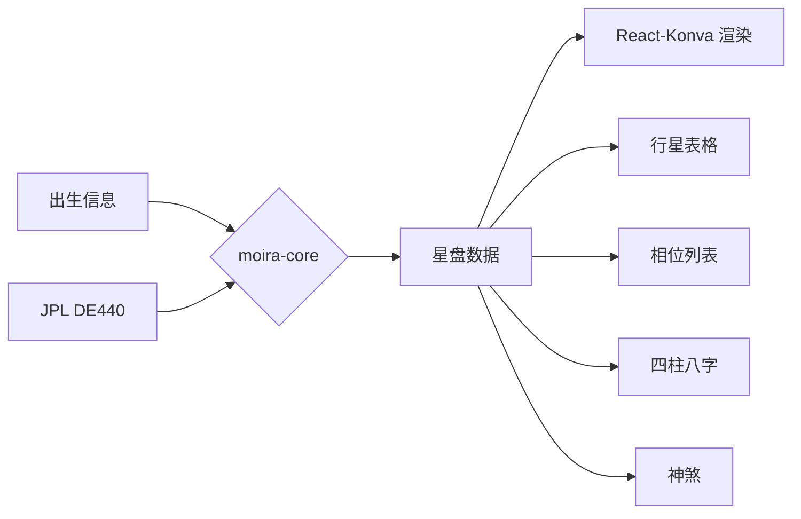

# Moira

中国传统占星学应用。以七政四馀为主，涵盖二十八宿、神煞、四柱八字等中国星命学体系。

## 架构

Tauri v2 桌面应用。Rust 库 (`moira-core`) 负责天文计算和排盘逻辑，React + Vite 前端负责 UI 渲染。

## 三大模块

- **七政四馀** (Qīzhèng Sìyú): 基于真实天体位置的传统占星体系。项目核心。
- **天星擇日** (Tiānxīng Zérì): 选择吉日良辰的择日学，基于天体位置推算吉凶。
- **占星** (Zhānxīng): 西洋占星体系，含宫位、相位、推运等。扩展功能。

## 领域语言

### 星曜

- **七政** (Qīzhèng): 太阳、太阴、水星、金星、火星、木星、土星
- **三王** (Sān Wáng): 天王星、海王星、冥王星（现代星曜）
- **四馀** (Sìyú): 罗睺（月升交点）、计都（月降交点）、月孛（月远地点）、紫炁
- **福点** (Part of Fortune): 从太阳、月亮、上升位置计算的特殊点
- **上升** (Ascendant): 东升点，命宫起始
- **天顶** (MC / Midheaven): 中天，第十宫起始
- **小行星**: 谷神星 (Ceres)、智神星 (Pallas)、婚神星 (Juno)、灶神星 (Vesta)、凯龙星 (Chiron)

### 宫位

- **十二宫**: 星盘划分的十二个生活领域。用上升定位第一宫。
- **宫位制**: Placidus、Equal、Koch、Regiomontanus 等。项目目前使用 Equal House。

### 二十八宿

中国传统的二十八个月站（宿），沿黄道分布，每宿对应特定度数范围。用于七政和择日。
_避免_: 西方星座

### 神煞

星盘中的吉凶神煞标志。原 Moira 有超过一百项神煞可供选择，部分从年支计算，部分从日干计算。

### 四柱八字

- **四柱**: 年柱、月柱、日柱、时柱
- **大运**: 十年一大运，干支表示人生各阶段运势
- **十神**: 正官、七杀、正印、偏印、比肩、劫财、食神、伤官、正财、偏财
- **藏干**: 地支中藏有的天干
- **长生十二宫**: 十二种生命状态（长生、沐浴、冠带、临官、帝旺、衰、病、死、墓、绝、胎、养）
- **胎元**: 从月柱推算的受孕月份干支
- **日元神煞**: 从日干推算的神煞

### 天星择日

- **动盘**: 以事件时间排盘，可选子正为真北或磁北
- **地平/黄道动盘**: 动盘的坐标系统选择
- **日出/日落立命**: 以日出或日落时刻确定命宫
- **太阳到山**: 搜索太阳到达特定方位的时间
- **磁偏修正**: 修正地磁偏角

### 西洋占星推运

- **太阳返照盘** (Solar Return): 每年太阳回到出生位置的星盘
- **太阴返照盘** (Lunar Return): 每月月亮回到出生位置的星盘
- **流年盘** (Transits): 当前行星与原盘行星的互动
- **主限盘** (Primary Directions): 古老推运法，基于地球自转
- **次限盘** (Secondary Progressions): 一天代表一年
- **太阳弧角盘** (Solar Arc Directions): 太阳弧度推进
- **关系盘**: 组合盘 (Composite) 和 比较盘 (Synastry)

### 其他

- **立命安身**: 确定命宫和身宫
- **角距** (Angular Distance / Orb): 行星间的角度距离差，用于判断相位有效性
- **喜忌格**: 七政四馀中的吉格局和凶格局
- **十干化曜**: 十天干对应的化曜星
- **小限/月限/洞微飞限**: 流年流月的推算方法
- **高格林盘** (Gauquelin Sectors): 高格林扇形区
- **回归制/恒星制**: 回归黄道 vs 恒星黄道的选择

### 历法工具

- **阴历→公历转换**: 农历日期转换为公历
- **反推八字时间**: 根据事件反推八字时间
- **日月蚀搜索**: 搜索指定时间段内的日蚀和月蚀时间
- **夏令时间修正**: 自动修正夏令时间

## 数据流

## 原 Moira 参考

项目以 Java 桌面版 [Moira by At Home Projects](https://sourceforge.net/projects/moiramega/) 为功能参考目标，但使用 Tauri + Rust + React 完全重写。

原版功能对比文档见 `docs/at-home-projects-moira-research.md`。

## Flagged ambiguities

- "Moira" 是希腊命运女神名，项目内容为中国传统占星 — 已决定保留作为开发代号
- "神煞" 在不同体系中定义不同：七政有七政的神煞表，原 Moira 有超过一百项— 需逐步实现
- 回归制 vs 恒星制：两个系统的推算结果不同 — 需提供切换选项
